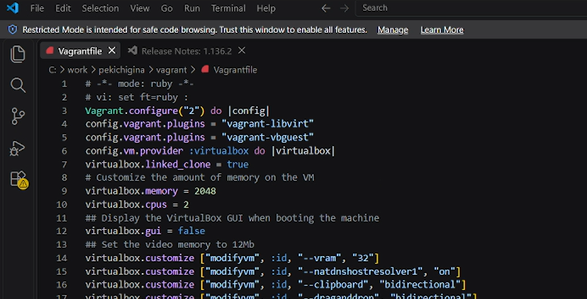
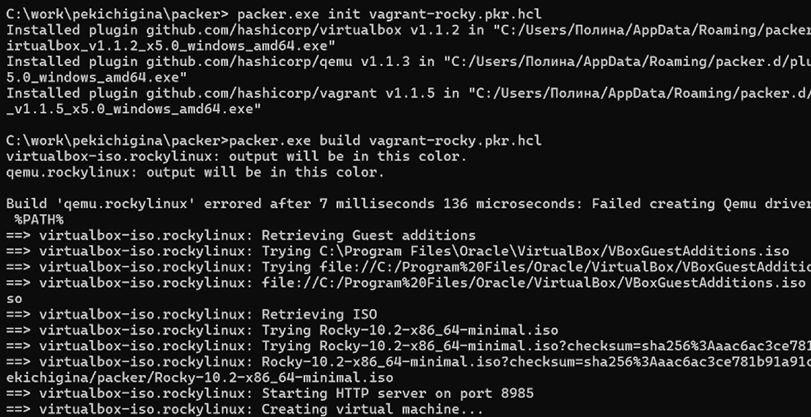
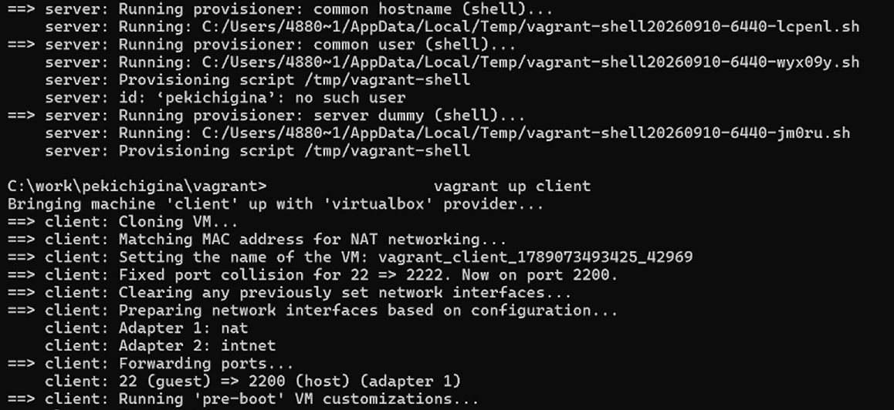

---
## Front matter
lang: ru-RU
title: Лабороторная работа № 1
author:
  - Кичигина Полина Евгеньевна
institute:
  - Российский университет дружбы народов, Москва, Россия
date: 12 сентября 2026

## i18n babel
babel-lang: russian
babel-otherlangs: english

## Formatting pdf
toc: false
toc-title: Содержание
slide_level: 2
aspectratio: 169
section-titles: true
theme: metropolis
header-includes:
 - \metroset{progressbar=frametitle,sectionpage=progressbar,numbering=fraction}
---

## Цель работы

Целью данной работы является приобретение практических навыков установки
Rocky Linux на виртуальную машину с помощью инструмента Vagrant.

## Задание

1. Сформируйте box-файл с дистрибутивом Rocky Linux для VirtualBox.
2. Запустите виртуальные машины сервера и клиента и убедитесь в их работоспособности.
3. Внесите изменения в настройки загрузки образов виртуальных машин server
и client, добавив пользователя с правами администратора и изменив названия
хостов.
4. Скопируйте необходимые для работы с Vagrant файлы и box-файлы виртуальных
машин на внешний носитель. Используя эти файлы, вы можете попробовать развернуть виртуальные машины на другом компьютере.

## Выполнение лабораторной работы

 
1. Создаем директорию со всеми подкаталогами и помещаем туда дистрабутив. 

{#fig:001 width=50%}

## 2. Создаем файлы и помещаем туда код.

{#fig:002 width=75%}

## Развёртывание лабораторного стенда на ОС Windows.

В данном разделе приведена последовательность действий при развёртывании
образа виртуальной машины в ОС Windows на домашнем компьютере в VirtualBox
с использованием Vagrant. 

{#fig:003 width=60%}

## 
По окончании процесса в рабочем каталоге сформируется box-файл
с названием vagrant-virtualbox-rockylinux10-x86_64.box. 

{#fig:004 width=70%}

## 

Регистрируем образ виртуальной машины и запускаем.

{#fig:005 width=75%}

## 

Убедитесь, что запуск обеих виртуальных машин прошёл успешно, залогиньтесь
под пользователем vagrant с паролем vagrant в графическом окружении.

{#fig:006 width=60%}

##

Перейдите к пользователю user (вместо user должен быть указан ваш логин):
su - user. Отлогиньтесь. Выполните тоже самое для клиента. Выключите обе виртуальные машины.

{#fig:007 width=75%}

## Выводы

Мы приобретели  практические навыки установки
Rocky Linux на виртуальную машину с помощью инструмента Vagrant.

## {.standout}

Спасибо за внимание!
