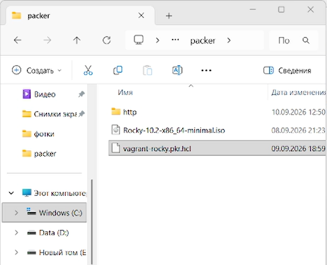
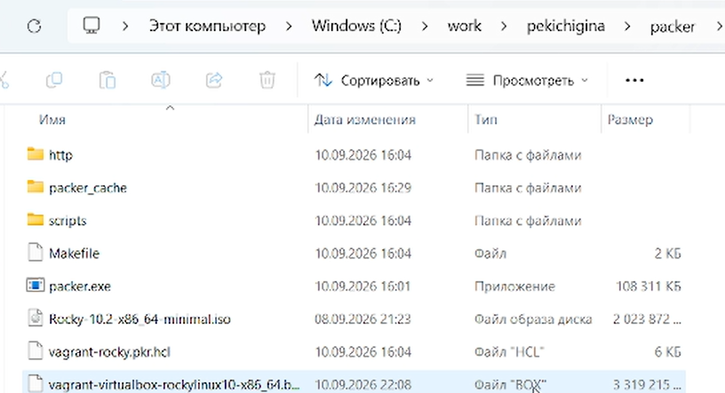
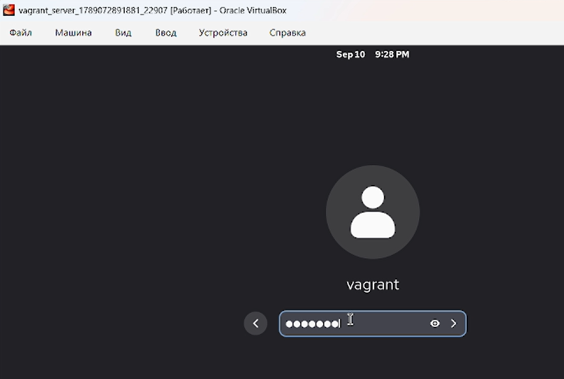
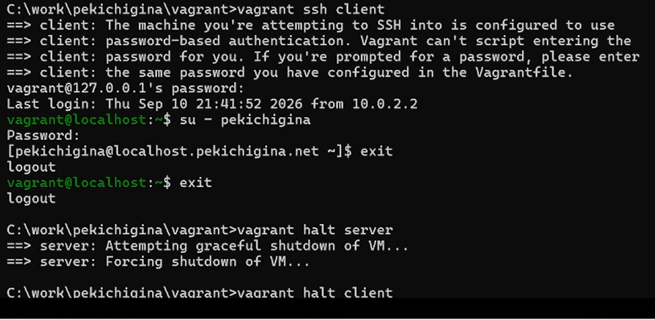

---
## Front matter
title: " Отчёт по лабораторной работе №1"
subtitle: "Отчет"
author: "Кичигина Полина Евгеньевна"

## Generic otions
lang: ru-RU
toc-title: "Содержание"

## Bibliography
bibliography: bib/cite.bib
csl: pandoc/csl/gost-r-7-0-5-2008-numeric.csl

## Pdf output format
toc: true # Table of contents
toc-depth: 2
lof: true # List of figures
lot: true # List of tables
fontsize: 12pt
linestretch: 1.5
papersize: a4
documentclass: scrreprt
## I18n polyglossia
polyglossia-lang:
  name: russian
  options:
	- spelling=modern
	- babelshorthands=true
polyglossia-otherlangs:
  name: english
## I18n babel
babel-lang: russian
babel-otherlangs: english
## Fonts
mainfont: IBM Plex Serif
romanfont: IBM Plex Serif
sansfont: IBM Plex Sans
monofont: IBM Plex Mono
mathfont: STIX Two Math
mainfontoptions: Ligatures=Common,Ligatures=TeX,Scale=0.94
romanfontoptions: Ligatures=Common,Ligatures=TeX,Scale=0.94
sansfontoptions: Ligatures=Common,Ligatures=TeX,Scale=MatchLowercase,Scale=0.94
monofontoptions: Scale=MatchLowercase,Scale=0.94,FakeStretch=0.9
mathfontoptions:
## Biblatex
biblatex: true
biblio-style: "gost-numeric"
biblatexoptions:
  - parentracker=true
  - backend=biber
  - hyperref=auto
  - language=auto
  - autolang=other*
  - citestyle=gost-numeric
## Pandoc-crossref LaTeX customization
figureTitle: "Рис."
tableTitle: "Таблица"
listingTitle: "Листинг"
lofTitle: "Список иллюстраций"
lotTitle: "Список таблиц"
lolTitle: "Листинги"
## Misc options
indent: true
header-includes:
  - \usepackage{indentfirst}
  - \usepackage{float} # keep figures where there are in the text
  - \floatplacement{figure}{H} # keep figures where there are in the text
---

# Цель работы

Целью данной работы является приобретение практических навыков установки
Rocky Linux на виртуальную машину с помощью инструмента Vagrant.

# Задание

1. Сформируйте box-файл с дистрибутивом Rocky Linux для VirtualBox.
2. Запустите виртуальные машины сервера и клиента и убедитесь в их работоспособности.
3. Внесите изменения в настройки загрузки образов виртуальных машин server
и client, добавив пользователя с правами администратора и изменив названия
хостов.
4. Скопируйте необходимые для работы с Vagrant файлы и box-файлы виртуальных
машин на внешний носитель. Используя эти файлы, вы можете попробовать развернуть виртуальные машины на другом компьютере.

# Выполнение лабораторной работы

 
1. Перед началом работы с Vagrant создайте каталог для проекта.
В ОС Linux рекомендуется работать в /var/tmp:
mkdir -p /var/tmp/user_name/packer
mkdir -p /var/tmp/user_name/vagrant
где user_name — идентифицирующее вас имя пользователя, обычно первые буквы
инициалов и фамилия.
В ОС Windows, например, C:/work/user_name/packer и C:/work/user_name/vagrant,
где user_name — идентифицирующее вас имя пользователя, обычно первые буквы
инициалов и фамилия.
2. В созданном рабочем каталоге в подкаталоге packer разместите образ вариан-
та операционной системы Rocky Linux (в этом практикуме будем использовать
Rocky-10.0-x86_64-minimal.iso — минимальный дистрибутив Rocky Linux, который
можно взять с сайта https://rockylinux.org/download/). При работе в дис-
плейном классе университета дистрибутив можно взять из общего каталога
/afs/dk.sci.pfu.edu.ru/common/files/iso/.(рис. [-@fig:001])

{#fig:001 width=70%}

3. В этом же рабочем каталоге разместите подготовленные заранее для работы
с Vagrant файлы:
– в подкаталоге packer файл vagrant-rocky.pkr.hcl — специальный файл с опи-
санием метаданных по установке дистрибутива на виртуальную машину
(содержание используемого в данном практикуме файла .hcl приведено в разде-
ле 1.5.1.1); в частности, в разделе переменных этот файл содержит указание на
версию дистрибутива, его хэш-функцию, имя и пароль пользователя по умолча-
нию; в разделе builders указаны специальные синтаксические конструкции для
автоматизации работы VirtualBox; в разделе provisioners прописаны действия
(по сути shell-скрипт) по установке дополнительных пакетов дистрибутива;
– в подкаталоге packer подкаталог http с файлом ks.cfg — определяет настрой-
ки для установки дистрибутива, которые пользователь обычно вводит вручную,
в частности настройки языка интерфейса, языковые настройки клавиатуры,
тайм-зону, сетевые настройки и т.п.; файл ks.cfg должен быть расположен
в подкаталоге http (содержание используемого в данном практикуме файла
./http/ks.cfg приведено в разделе 1.5.1.2);
– в подкаталоге vagrant файл Vagrantfile — файл с конфигурацией запуска вир-
туальных машин — сервера и клиента (содержание используемого в данном
практикуме на данном этапе файла Vagrantfile приведено в разделе 1.5.1.3);
– в подкаталоге vagrant файл Makefile — набор инструкций для программы make
по работе с Vagrant (содержание используемого в данном практикуме файла
Makefile приведено в разделе 1.5.1.5). (рис. [-@fig:002])

{#fig:002 width=70%}

Основное назначение Makefile в этом практикуме — применение команд Vagrant
в ОС Linux в определённом каталоге — только в каталоге с проектом (в частно-
сти в /var/tmp/user_name/vagrant). Для пользователей, работающих с Vagrant в ОС
Windows, Makefile не понадобится.
4. В этом же рабочем каталоге в подкаталоге vagrant создайте каталог provision
с подкаталогами default, server и client, в которых будут размещаться скрипты,
изменяющие настройки внутреннего окружения базового (общего) образа вирту-
альной машины, сервера или клиента соответственно.
5. В каталогах default, server и client разместите заранее подготовленный скрипт-
заглушку 01-dummy.sh.
. В каталоге default разместите заранее подготовленный скрипт 01-user.sh по из-
менению названия виртуальной машины.
7. В каталоге default разместите заранее подготовленный скрипт 01-hostname.sh по
изменению названия виртуальной машины.
8. В каталоге server разместите заранее подготовленный скрипт 02-forward.sh.
9. В каталоге client разместите заранее подготовленный скрипт 01-routing.sh.

Развёртывание лабораторного стенда на ОС Windows.

В данном разделе приведена последовательность действий при развёртывании
образа виртуальной машины в ОС Windows на домашнем компьютере в VirtualBox
с использованием Vagrant. После установки необходимого программного обеспечения
не забудьте перегрузить систему.
Далее выполните следующие действия:
1. Используя FAR, перейдите в созданный вами рабочий каталог с проектом. В этом
же каталоге должен быть размещён файл packer.exe. В командной строке введите
packer.exe init vagrant-rocky.pkr.hcl
packer.exe build vagrant-rocky.pkr.hcl (рис. [-@fig:003])

{#fig:003 width=70%}

для начала автоматической установки образа операционной системы Rocky Linux
в VirtualBox и последующего формирования box-файла с дистрибутивом Rocky Linux
для VirtualBox. По окончании процесса в рабочем каталоге сформируется box-файл
с названием vagrant-virtualbox-rockylinux10-x86_64.box. (рис. [-@fig:004])

{#fig:004 width=70%}

2. Для регистрации образа виртуальной машины в vagrant в командной строке введи-
те
vagrant box add rockylinux10 vagrant-virtualbox-rockylinux10-x86_64.box
3. Для запуска виртуальной машины Server введите в консоли
vagrant up server
4. Для запуска виртуальной машины Client введите в консоли
vagrant up client(рис. [-@fig:005])

{#fig:005 width=70%}

5. Убедитесь, что запуск обеих виртуальных машин прошёл успешно, залогиньтесь
под пользователем vagrant с паролем vagrant в графическом окружении.
6. Подключитесь к серверу из консоли:
vagrant ssh server
7. Введите пароль vagrant.(рис. [-@fig:006])

{#fig:006 width=70%}

8. Перейдите к пользователю user (вместо user должен быть указан ваш логин):
su - user
9. Отлогиньтесь.
10. Выполните тоже самое для клиента.
11. Выключите обе виртуальные машины:
vagrant halt server
vagrant halt client(рис. [-@fig:007])

{#fig:007 width=70%}

# Контрольные вопросы

1. Vagrant — инструмент для создания и управления воспроизводимыми виртуальными средами (ВМ) с единым рабочим процессом, используемый для разработки и тестирования инфраструктуры.

2. Box-файл — это архив (tar/tar.gz/zip) с образом виртуальной машины для конкретного провайдера (VirtualBox, VMware и т.д.). Vagrantfile — конфигурационный файл проекта, описывающий тип и параметры ВМ, её настройку и провижининг

3. Основные команды: vagrant up (запуск), vagrant halt (остановка), vagrant ssh (вход по SSH), vagrant destroy (удаление), vagrant status (статус), vagrant reload (перезагрузка с новым Vagrantfile).

4. Построчные пояснения требуют содержимого файлов, которого нет в вопросе. vagrant-rocky.pkr.hcl — конфигурация Packer для сборки box; ks.cfg — Kickstart-файл автоматической установки Rocky Linux; Vagrantfile — конфигурация ВМ; Makefile — автоматизация сборки/управления.

# Выводы

Мы приобретели  практические навыки установки
Rocky Linux на виртуальную машину с помощью инструмента Vagrant.

