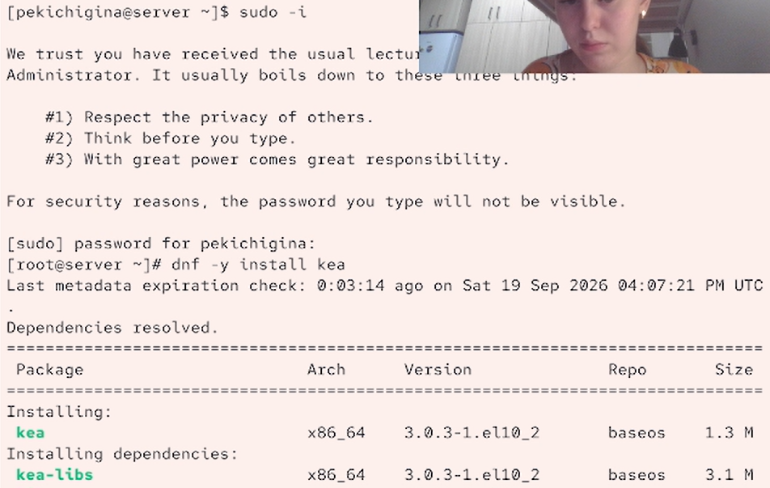
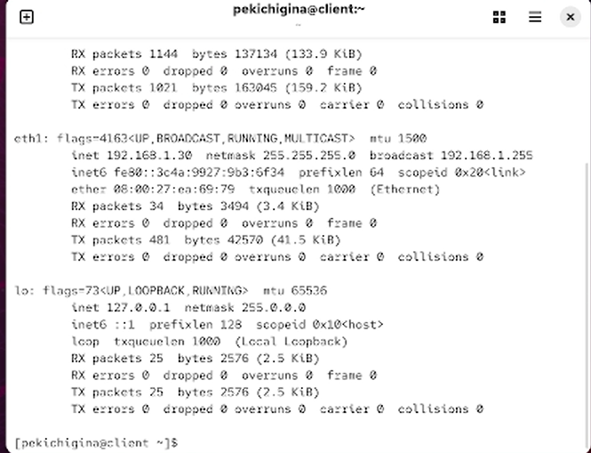
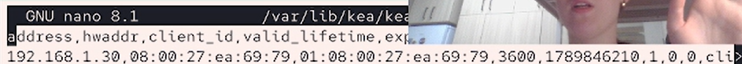

---
## Front matter
lang: ru-RU
title: Лабороторная работа №3
author:
  - Кичигина Полина Евгеньевна
institute:
  - Российский университет дружбы народов, Москва, Россия
date: 19 сентября 2026

## i18n babel
babel-lang: russian
babel-otherlangs: english

## Formatting pdf
toc: false
toc-title: Содержание
slide_level: 2
aspectratio: 169
section-titles: true
theme: metropolis
header-includes:
 - \metroset{progressbar=frametitle,sectionpage=progressbar,numbering=fraction}
---

## Цель работы

Приобретение практических навыков по установке и конфигурированию DHCP-
сервера.

## Задания

1. Установите на виртуальной машине server DHCP-сервер.
2. Настройте виртуальную машину server в качестве DHCP-сервера для виртуальной
внутренней сети.
3. Проверьте корректность работы DHCP-сервера в виртуальной внутренней сети
путём запуска виртуальной машины client и применения соответствующих утилит
диагностики.
4. Настройте обновление DNS-зоны при появлении в виртуальной внутренней сети
новых узлов.
5. Проверьте корректность работы DHCP-сервера и обновления DNS-зоны в виртуаль-
ной внутренней сети путём запуска виртуальной машины client и применения
соответствующих утилит диагностики.
6. Напишите скрипт для Vagrant, фиксирующий действия по установке и настройке
DHCP-сервера во внутреннем окружении виртуальной машины server. Соответ-
ствующим образом внести изменения в Vagrantfile.

## Выполнение лабораторной работы

На виртуальной машине server войдите под вашим пользователем и откройте тер-
минал. Перейдите в режим суперпользователя. Установите dhcp.

{#fig:001 width=50%}

## Конфигурирование DHCP-сервера

Была настроена выдача IP-адресов клиентам в сети 192.168.1.0/24 из диапазона 192.168.1.30–192.168.1.199, а в качестве шлюза и DNS-сервера указан адрес 192.168.1.1. Также были выполнены настройка DNS-зоны, разрешение DHCP в firewall, настройка SELinux и запуск службы kea-dhcp4.

{#fig:002 width=50%}

## Анализ работы DHCP-сервера

На клиентской машине была настроена сеть таким образом, чтобы адрес на внутреннем интерфейсе получался автоматически от DHCP-сервера. Полученный клиентом IP-адрес и выданная аренда были проверены на сервере в файле /var/lib/kea/kea-leases4.csv.

{#fig:003 width=40%}

##
 На машине server посмотрите список выданных адресов:
cat /var/lib/kea/kea-leases4.csv.

{#fig:004 width=70%}

## Настройка обновления DNS-зоны

Требуется настроить обновление DNS-зоны при появлении в виртуальной внутрен-
ней сети новых узлов. В каталоге прямой DNS-зоны /var/named/master/fz должен появиться файл
user.net.jnl, в котором в бинарном файле автоматически вносятся изменения
записей зоны.

{#fig:005 width=45%}

## Анализ работы DHCP-сервера после настройки обновления DNS-зоны

На виртуальной машине client под вашим пользователем откройте терминал и с по-
мощью утилиты dig убедитесь в наличии DNS-записи о клиенте в прямой DNS-зоне.

{#fig:006 width=50%}

## Внесение изменений в настройки внутреннего окружения виртуальной машины

Для автоматизации настройки сервера были сохранены конфигурационные файлы Kea и DNS в каталоге /vagrant/provision/server. Также был создан скрипт dhcp.sh и добавлен в Vagrantfile, что позволяет автоматически устанавливать и запускать DHCP-сервисы при развёртывании виртуальной машины.

{#fig:007 width=45%}

# Выводы

Мы получили практические навыки по установке и конфигурированию DHCP-
сервера.

## {.standout}

Спасибо за внимание!

