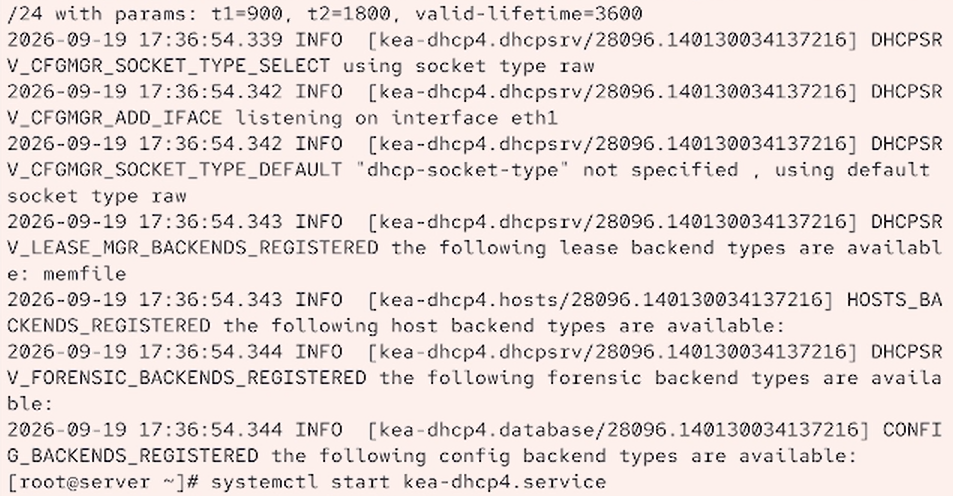
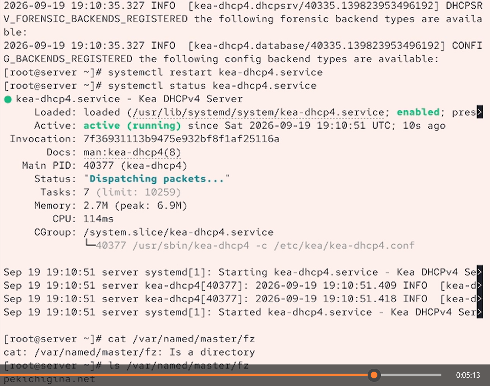
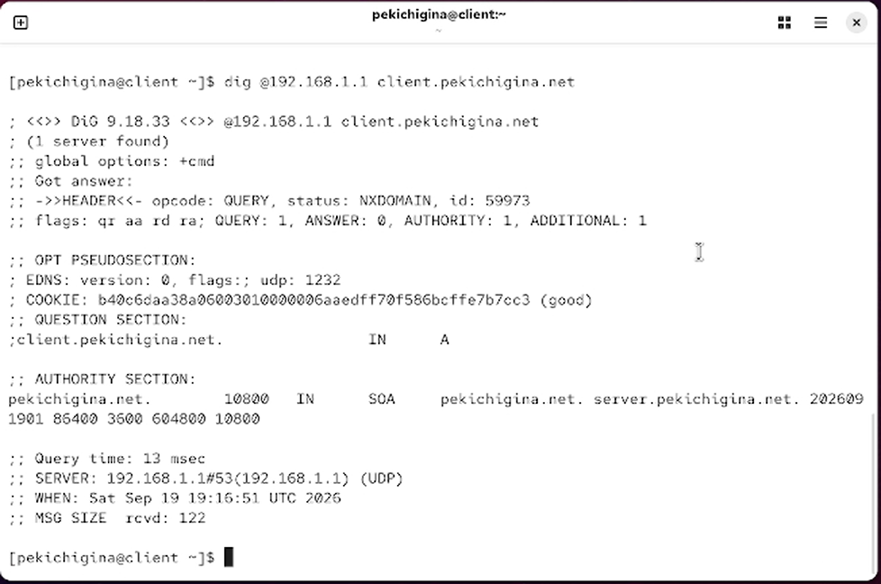
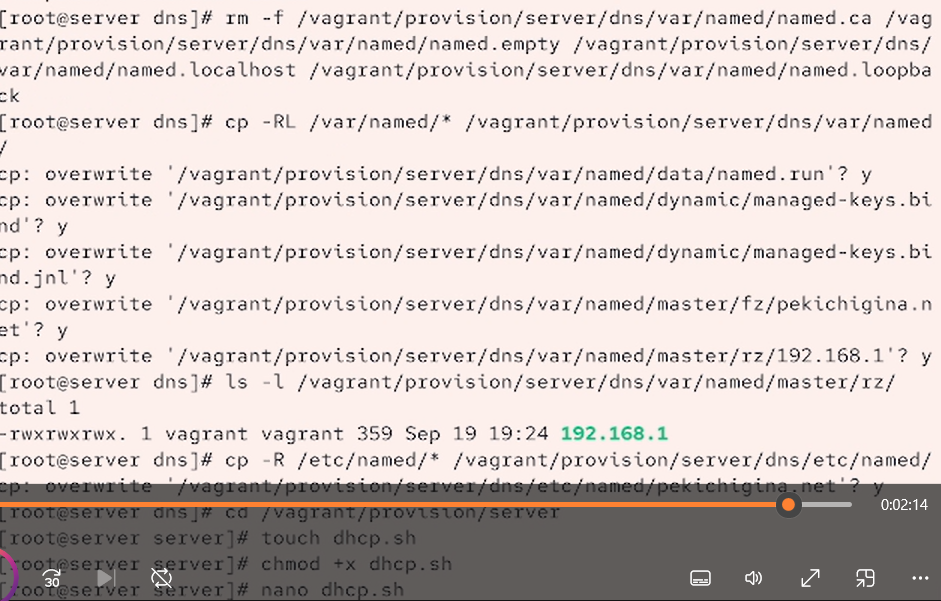

---
## Front matter
title: "Отчёт по лабораторной работе №3"
subtitle: "Отчет"
author: "Кичигина Полина Евгеньевна"

## Generic otions
lang: ru-RU
toc-title: "Содержание"

## Bibliography
bibliography: bib/cite.bib
csl: pandoc/csl/gost-r-7-0-5-2008-numeric.csl

## Pdf output format
toc: true # Table of contents
toc-depth: 2
lof: true # List of figures
lot: true # List of tables
fontsize: 12pt
linestretch: 1.5
papersize: a4
documentclass: scrreprt
## I18n polyglossia
polyglossia-lang:
  name: russian
  options:
	- spelling=modern
	- babelshorthands=true
polyglossia-otherlangs:
  name: english
## I18n babel
babel-lang: russian
babel-otherlangs: english
## Fonts
mainfont: IBM Plex Serif
romanfont: IBM Plex Serif
sansfont: IBM Plex Sans
monofont: IBM Plex Mono
mathfont: STIX Two Math
mainfontoptions: Ligatures=Common,Ligatures=TeX,Scale=0.94
romanfontoptions: Ligatures=Common,Ligatures=TeX,Scale=0.94
sansfontoptions: Ligatures=Common,Ligatures=TeX,Scale=MatchLowercase,Scale=0.94
monofontoptions: Scale=MatchLowercase,Scale=0.94,FakeStretch=0.9
mathfontoptions:
## Biblatex
biblatex: true
biblio-style: "gost-numeric"
biblatexoptions:
  - parentracker=true
  - backend=biber
  - hyperref=auto
  - language=auto
  - autolang=other*
  - citestyle=gost-numeric
## Pandoc-crossref LaTeX customization
figureTitle: "Рис."
tableTitle: "Таблица"
listingTitle: "Листинг"
lofTitle: "Список иллюстраций"
lotTitle: "Список таблиц"
lolTitle: "Листинги"
## Misc options
indent: true
header-includes:
  - \usepackage{indentfirst}
  - \usepackage{float} # keep figures where there are in the text
  - \floatplacement{figure}{H} # keep figures where there are in the text
---

# Цель работы

Приобретение практических навыков по установке и конфигурированию DHCP-
сервера.

# Задания

1. Установите на виртуальной машине server DHCP-сервер.
2. Настройте виртуальную машину server в качестве DHCP-сервера для виртуальной
внутренней сети.
3. Проверьте корректность работы DHCP-сервера в виртуальной внутренней сети
путём запуска виртуальной машины client и применения соответствующих утилит
диагностики.
4. Настройте обновление DNS-зоны при появлении в виртуальной внутренней сети
новых узлов.
5. Проверьте корректность работы DHCP-сервера и обновления DNS-зоны в виртуаль-
ной внутренней сети путём запуска виртуальной машины client и применения
соответствующих утилит диагностики.
6. Напишите скрипт для Vagrant, фиксирующий действия по установке и настройке
DHCP-сервера во внутреннем окружении виртуальной машины server. Соответ-
ствующим образом внести изменения в Vagrantfile.

# Выполнение лабораторной работы

Установка DHCP-сервера

1. Загрузите вашу операционную систему и перейдите в рабочий каталог с проектом:
cd /var/tmp/user_name/vagrant
Здесь user_name — идентифицирующее вас имя пользователя, обычно первые буквы
инициалов и фамилия.
2. Запустите виртуальную машину server:
make server-up
(или, если вы работаете под ОС Windows, то vagrant up server).
3. На виртуальной машине server войдите под вашим пользователем и откройте тер-
минал. Перейдите в режим суперпользователя:
sudo -i
4. Установите dhcp:
dnf -y install kea(рис. [-@fig:001])

{#fig:001 width=70%}

Конфигурирование DHCP-сервера

1. Сохраните на всякий случай конфигурационный файл:
cp /etc/kea/kea-dhcp4.conf /etc/kea/kea-dhcp4.conf__$(date -I)
2. Откройте файл /etc/kea/kea-dhcp4.conf на редактирование.
4. Проверьте правильность конфигурационного файла:
kea-dhcp4 -t /etc/kea/kea-dhcp4.conf
5. Перезагрузите конфигурацию dhcpd и разрешите загрузку DHCP-сервера при за-
пуске виртуальной машины server:
systemctl --system daemon-reload
systemctl enable kea-dhcp4.service
6. Добавьте запись для DHCP-сервера в конце файла прямой DNS-зоны
/var/named/master/fz/user.net:
dhcp A 192.168.1.1
и в конце файла обратной зоны /var/named/master/rz/192.168.1:
1 PTR dhcp.user.net.
(вместо user укажите свой логин).
При этом не забудьте в обоих файлах изменить серийный номер файла зоны, указав
текущую дату в нотации ГГГГММДДВВ.
7. Перезапустите named:
systemctl restart named
8. Проверьте, что можно обратиться к DHCP-серверу по имени:
ping dhcp.user.net
(вместо user укажите свой логин).
Если в доступе будет отказано, то возможно потребуется исправить ошибки в кон-
фигурационных файлах, скорректировать права доступа:
chown -R named:named /var/named
и ещё раз перезапустить named.
9. Внесите изменения в настройки межсетевого экрана узла server, разрешив работу
с DHCP:
firewall-cmd --list-services
firewall-cmd --get-services
firewall-cmd --add-service=dhcp
firewall-cmd --add-service=dhcp --permanent
10. Восстановите контекст безопасности в SELinux:
restorecon -vR /etc
restorecon -vR /var/named
restorecon -vR /var/lib/kea/
11. В дополнительном терминале запустите мониторинг происходящих в системе про-
цессов в реальном времени:
tail -f /var/log/messages
12. В основном рабочем терминале запустите DHCP-сервер:
systemctl start kea-dhcp4.service
13. Если запуск DHCP-сервера прошёл успешно, то, не выключая виртуальной машины
server и не прерывая на ней мониторинга происходящих в системе процессов,
приступите к анализу работы DHCP-сервера на клиенте (р.(рис. [-@fig:002])

{#fig:002 width=70%}

Анализ работы DHCP-сервера

1. Перед запуском виртуальной машины client в каталоге с проектом в вашей
операционной системе в подкаталоге vagrant/provision/client создайте файл 01-
routing.sh:
cd /var/tmp/user_name/vagrant/provision/client
touch 01-routing.sh
chmod +x 01-routing.sh
Открыв его на редактирование, пропишите в нём  скрипт.
Этот скрипт изменяет настройки NetworkManager так, чтобы весь трафик на вирту-
альной машине client шёл по умолчанию через интерфейс eth1.
2. В Vagrantfile подключите этот скрипт в разделе конфигурации для клиента:
client.vm.provision "client routing",
type: "shell",
preserve_order: true,
run: "always",
path: "provision/client/01-routing.sh"
3. Зафиксируйте внесённые изменения для внутренних настроек виртуальной маши-
ны client и запустите её, введя в терминале:
make client-provision
(для работающих под ОС Windows: vagrant up client --provision).
4. После загрузки виртуальной машины client вы можете увидеть на виртуальной
машине server на терминале с мониторингом происходящих в системе процессов
записи о подключении к виртуальной внутренней сети узла client и выдачи ему
IP-адреса из соответствующего диапазона адресов. Также информацию о работе
DHCP-сервера можно наблюдать в файле /var/lib/kea/kea-leases4.csv.
5. Войдите в систему виртуальной машины client под вашим пользователем и от-
кройте терминал. В терминале введите
ifconfig
На экран будет выведена информация об имеющихся интерфейсах.(рис. [-@fig:003])

{#fig:003 width=70%}

6. На машине server посмотрите список выданных адресов:
cat /var/lib/kea/kea-leases4.csv(рис. [-@fig:004])

{#fig:004 width=70%}

Настройка обновления DNS-зоны

Требуется настроить обновление DNS-зоны при появлении в виртуальной внутрен-
ней сети новых узлов.
1. Создадим ключ на сервере с Bind9 (на виртуальной машине server):
mkdir -p /etc/named/keys
tsig-keygen -a HMAC-SHA512 DHCP_UPDATER > /etc/named/keys/dhcp_updater.key
2. Файл /etc/named/keys/dhcp_updater.key будет иметь следующий вид:
key "DHCP_UPDATER" {
algorithm hmac-sha512;
secret
"psFFSGdUIwK36l1G82LOw15PuIH4W5uB8h/cw7F0XDsjniBbwm/59tM+V3ydcCs15VLpe2pxlUlggWi↪
};
3. Поправим права доступа:
chown -R named:named /etc/named/keys
4. Подключим ключ в файле /etc/named.conf:
Королькова А. В., Кулябов Д. С. Администрирование сетевых подсистем 45
include "/etc/named/keys/dhcp_updater.key";
5. На виртуальной машине server под пользователем с правами суперпользовате-
ля отредактируйте файл /etc/named/user.net (вместо user укажите свой логин),
разрешив обновление зоны.
6. Сделаем проверку конфигурационного файла:
named-checkconf
7. Перезапустите DNS-сервер:
systemctl restart named
8. Сформируем ключ для Kea. Файл ключа назовём /etc/kea/tsig-keys.json:
touch /etc/kea/tsig-keys.json
9. Перенесём ключ на сервер Kea DHCP и перепишем его в формате json (используйте
Ваш ключ, не копируйте этот файл).
10. Сменим владельца:
chown kea:kea /etc/kea/tsig-keys.json
11. Поправим права доступа:
chmod 640 /etc/kea/tsig-keys.json
12. Настройка происходит в файле /etc/kea/kea-dhcp-ddns.conf. 
Обратите особое внимание на точку в конце имени зоны, иначе DDNS завершится
сбоем и сообщит, что не удалось найти соответствующее полное доменное имя.
13. Изменим владельца файла:
chown kea:kea /etc/kea/kea-dhcp-ddns.conf
14. Проверим файл на наличие возможных синтаксических ошибок:
kea-dhcp-ddns -t /etc/kea/kea-dhcp-ddns.conf
15. Запустим службу ddns:
systemctl enable --now kea-dhcp-ddns.service
16. Проверим статус работы службы:
systemctl status kea-dhcp-ddns.service
17. Внесите изменения в конфигурационный файл /etc/kea/kea-dhcp4.conf, добавив
в него разрешение на динамическое обновление DNS-записей с локального узла
прямой и обратной зон:
"dhcp-ddns": {
"enable-updates": true
},
"ddns-qualifying-suffix": "user.net",
"ddns-override-client-update": true,
(вместо user укажите свой логин).
18. Проверим файл на наличие возможных синтаксических ошибок:
kea-dhcp4 -t /etc/kea/kea-dhcp4.conf
19. Перезапустите DHCP-сервер:
systemctl restart kea-dhcp4.service
20. Проверим статус:
systemctl status kea-dhcp4.service
Королькова А. В., Кулябов Д. С. Администрирование сетевых подсистем 47
21. На машине client переполучите адрес:
nmcli connection down eth1
nmcli connection up eth1
22. В каталоге прямой DNS-зоны /var/named/master/fz должен появиться файл
user.net.jnl, в котором в бинарном файле автоматически вносятся изменения
записей зоны.(рис. [-@fig:005])

{#fig:005 width=70%}

Анализ работы DHCP-сервера после настройки
обновления DNS-зоны

На виртуальной машине client под вашим пользователем откройте терминал и с по-
мощью утилиты dig убедитесь в наличии DNS-записи о клиенте в прямой DNS-зоне:
dig @192.168.1.1 client.user.net(рис. [-@fig:006])

{#fig:006 width=70%}

Внесение изменений в настройки внутреннего окружения
виртуальной машины

1. На виртуальной машине server перейдите в каталог для внесения изменений
в настройки внутреннего окружения /vagrant/provision/server/, создайте в нём
каталог dhcp, в который поместите в соответствующие подкаталоги конфигураци-
онные файлы DHCP:
cd /vagrant/provision/server
mkdir -p /vagrant/provision/server/dhcp/etc/kea
cp -R /etc/kea/* /vagrant/provision/server/dhcp/etc/kea/
2. Замените конфигурационные файлы DNS-сервера:
cd /vagrant/provision/server/dns/
cp -R /var/named/* /vagrant/provision/server/dns/var/named/
cp -R /etc/named/* /vagrant/provision/server/dns/etc/named/
3. В каталоге /vagrant/provision/server создайте исполняемый файл dhcp.sh:
cd /vagrant/provision/server
touch dhcp.sh
chmod +x dhcp.sh
Открыв его на редактирование, пропишите в нём  скрипт.
Этот скрипт, по сути, повторяет произведённые вами действия по установке и на-
стройке DHCP-сервера.
4. Для отработки созданного скрипта во время загрузки виртуальной машины server
в конфигурационном файле Vagrantfile необходимо добавить в разделе конфигу-
рации для сервера:
server.vm.provision "server dhcp",
type: "shell",
preserve_order: true,
path: "provision/server/dhcp.sh"
5. После этого виртуальные машины client и server можно выключить.(рис. [-@fig:007])

{#fig:007 width=70%}

# Выводы

Мы получили практические навыки по установке и конфигурированию DHCP-
сервера.

