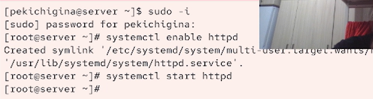
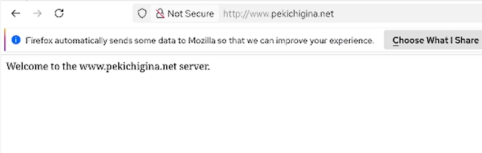
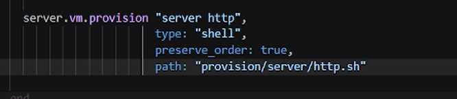

---
## Front matter
lang: ru-RU
title: Лабораторная работа №4
author:
  - Кичигина Полина Евгеньевна
institute:
  - Российский университет дружбы народов, Москва, Россия
date: 25 сентября  2026

## i18n babel
babel-lang: russian
babel-otherlangs: english

## Formatting pdf
toc: false
toc-title: Содержание
slide_level: 2
aspectratio: 169
section-titles: true
theme: metropolis
header-includes:
 - \metroset{progressbar=frametitle,sectionpage=progressbar,numbering=fraction}
---

## Цель работы

Приобретение практических навыков по установке и базовому конфигурированию
HTTP-сервера Apache.

## Задание

1. Установите необходимые для работы HTTP-сервера пакеты.
2. Запустите HTTP-сервер с базовой конфигурацией и проанализируйте его работу.
3. Настройте виртуальный хостинг.
4. Напишите скрипт для Vagrant, фиксирующий действия по установке и настройке
HTTP-сервера во внутреннем окружении виртуальной машины server. Соответствующим образом внесите изменения в Vagrantfile.

## Выполнение лабораторной работы

Установка HTTP-сервера.
Установите из репозитория стандартный веб-сервер (HTTP-сервер и утилиты httpd,
криптоутилиты и пр.).

{#fig:001 width=60%}

## Базовое конфигурирование HTTP-сервера

Внесите изменения в настройки межсетевого экрана узла server, разрешив работу
с http.В дополнительном терминале запустите в режиме реального времени расширенный лог системных сообщений, чтобы проверить корректность работы системы. В первом терминале активируйте и запустите HTTP-сервер.

{#fig:002 width=70%}

## Анализ работы HTTP-сервера

На виртуальной машине server просмотрите лог ошибок работы веб-сервера. На виртуальной машине server запустите мониторинг доступа к веб-серверу.
На виртуальной машине client запустите браузер и в адресной строке введите
192.168.1.1. Проанализируйте информацию, отразившуюся при мониторинге.

{#fig:003 width=50%}

## Настройка виртуального хостинга для HTTP-сервера

Требуется настроить виртуальный хостинг по двум DNS-адресам: server.user.net
и www.user.net. На виртуальной машине client убедитесь в корректном доступе к веб-серверу по адресам server.user.net.

{#fig:004 width=70%}

##

и www.user.net (вместо user укажите свой логин) в адресной
строке веб-браузера.

{#fig:005 width=70%}

## Внесение изменений в настройки внутреннего окружения виртуальной машины

Замените конфигурационные файлы DNS-сервера. В каталоге /vagrant/provision/server создайте исполняемый файл http.sh.Для отработки созданного скрипта во время загрузки виртуальных машин в конфигурационном файле Vagrantfile необходимо добавить в конфигурации сервера
следующую запись.

{#fig:006 width=70%}

## Выводы

Мы получили навыки работы по установке и базовому конфигурированию
HTTP-сервера Apache.

