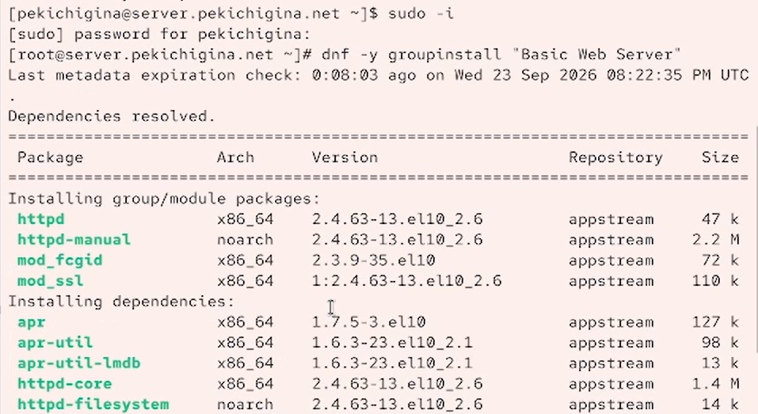
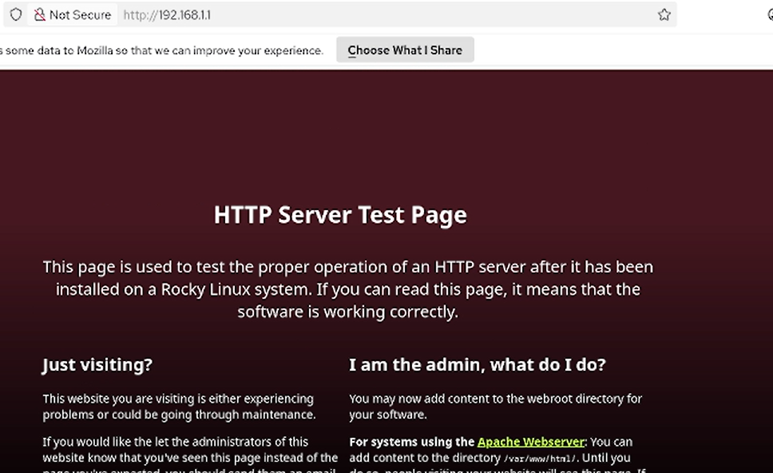
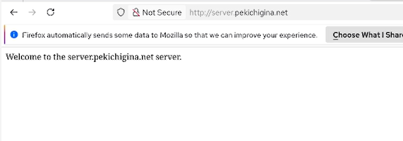

---
## Front matter
title: "Отчёт по лабораторной работе №4"
subtitle: "Отчет"
author: "Кичигина Полина Евгеньевна"

## Generic otions
lang: ru-RU
toc-title: "Содержание"

## Bibliography
bibliography: bib/cite.bib
csl: pandoc/csl/gost-r-7-0-5-2008-numeric.csl

## Pdf output format
toc: true # Table of contents
toc-depth: 2
lof: true # List of figures
lot: true # List of tables
fontsize: 12pt
linestretch: 1.5
papersize: a4
documentclass: scrreprt
## I18n polyglossia
polyglossia-lang:
  name: russian
  options:
	- spelling=modern
	- babelshorthands=true
polyglossia-otherlangs:
  name: english
## I18n babel
babel-lang: russian
babel-otherlangs: english
## Fonts
mainfont: IBM Plex Serif
romanfont: IBM Plex Serif
sansfont: IBM Plex Sans
monofont: IBM Plex Mono
mathfont: STIX Two Math
mainfontoptions: Ligatures=Common,Ligatures=TeX,Scale=0.94
romanfontoptions: Ligatures=Common,Ligatures=TeX,Scale=0.94
sansfontoptions: Ligatures=Common,Ligatures=TeX,Scale=MatchLowercase,Scale=0.94
monofontoptions: Scale=MatchLowercase,Scale=0.94,FakeStretch=0.9
mathfontoptions:
## Biblatex
biblatex: true
biblio-style: "gost-numeric"
biblatexoptions:
  - parentracker=true
  - backend=biber
  - hyperref=auto
  - language=auto
  - autolang=other*
  - citestyle=gost-numeric
## Pandoc-crossref LaTeX customization
figureTitle: "Рис."
tableTitle: "Таблица"
listingTitle: "Листинг"
lofTitle: "Список иллюстраций"
lotTitle: "Список таблиц"
lolTitle: "Листинги"
## Misc options
indent: true
header-includes:
  - \usepackage{indentfirst}
  - \usepackage{float} # keep figures where there are in the text
  - \floatplacement{figure}{H} # keep figures where there are in the text
---

# Цель работы

Приобретение практических навыков по установке и базовому конфигурированию
HTTP-сервера Apache.

# Задание

1. Установите необходимые для работы HTTP-сервера пакеты.
2. Запустите HTTP-сервер с базовой конфигурацией и проанализируйте его работу.
3. Настройте виртуальный хостинг.
4. Напишите скрипт для Vagrant, фиксирующий действия по установке и настройке
HTTP-сервера во внутреннем окружении виртуальной машины server. Соответствующим образом внесите изменения в Vagrantfile.

# Выполнение лабораторной работы

Установка HTTP-сервера

1. Загрузите вашу операционную систему и перейдите в рабочий каталог с проектом:
cd /var/tmp/user_name/vagrant
где user_name — идентифицирующее вас имя пользователя, обычно первые буквы
инициалов и фамилия.
2. Запустите виртуальную машину server:
make server-up
(или, если вы работаете под ОС Windows, то vagrant up server).
3. На виртуальной машине server войдите под вашим пользователем и откройте тер-
минал. Перейдите в режим суперпользователя.
4. Установите из репозитория стандартный веб-сервер (HTTP-сервер и утилиты httpd,
криптоутилиты и пр.).(рис. [-@fig:001])

{#fig:001 width=70%}

Базовое конфигурирование HTTP-сервера

1. Просмотрите и прокомментируйте в отчёте содержание конфигурационных файлов
в каталогах /etc/httpd/conf и /etc/httpd/conf.d.
2. Внесите изменения в настройки межсетевого экрана узла server, разрешив работу
с http.
3. В дополнительном терминале запустите в режиме реального времени расширен-
ный лог системных сообщений, чтобы проверить корректность работы системы:
journalctl -x -f
4. В первом терминале активируйте и запустите HTTP-сервер.
Просмотрев расширенный лог системных сообщений, убедитесь, что веб-сервер
успешно запустился.(рис. [-@fig:002])

{#fig:002 width=70%}

Анализ работы HTTP-сервера

1. Запустите виртуальную машину client:
make client-up
(для работающих под ОС Windows: vagrant up client).
2. На виртуальной машине server просмотрите лог ошибок работы веб-сервера:
tail -f /var/log/httpd/error_log
3. На виртуальной машине server запустите мониторинг доступа к веб-серверу:
tail -f /var/log/httpd/access_log
На виртуальной машине client запустите браузер и в адресной строке введите
192.168.1.1. Проанализируйте информацию, отразившуюся при мониторинге.(рис. [-@fig:003])

{#fig:003 width=70%}

Настройка виртуального хостинга для HTTP-сервера

Требуется настроить виртуальный хостинг по двум DNS-адресам: server.user.net
и www.user.net.
1. Остановите работу DNS-сервера для внесения изменений в файлы описания DNS-
зон:
systemctl stop named
2. Добавьте запись для HTTP-сервера в конце файла прямой DNS-зоны
/var/named/master/fz/user.net:
www A 192.168.1.1
и в конце файла обратной зоны /var/named/master/rz/192.168.1:
1 PTR www.user.net.
Вместо user укажите свой логин. При этом не забудьте из соответствующих катало-
гов удалить файлы журналов DNS: user.net.jnl и 192.168.1.jnl.
3. Перезапустите DNS-сервер:
systemctl start named
4. В каталоге /etc/httpd/conf.d создайте файлы server.user.net.conf и
www.user.net.conf (вместо user укажите свой логин).
5. Откройте на редактирование файл server.user.net.conf.
(вместо user укажите свой логин).
6. Откройте на редактирование файл www.user.net.conf и внесите следующее содер-
жание(вместо user укажите свой логин).
7. Перейдите в каталог /var/www/html, в котором должны находиться файлы с содер-
жимым (контентом) веб-серверов, и создайте тестовые страницы для виртуальных
веб-серверов server.user.net и www.user.net.
Для виртуального веб-сервера server.user.net (вместо user укажите свой логин).
Откройте на редактирование файл index.html и внесите следующее содержание:
Welcome to the server.user.net server.
(вместо user укажите свой логин).
Для виртуального веб-сервера www.user.net (вместо user укажите свой логин).
Откройте на редактирование файл index.html и внесите следующее содержание:
Welcome to the www.user.net server.
(вместо user укажите свой логин).
8. Скорректируйте права доступа в каталог с веб-контентом:
chown -R apache:apache /var/www
9. Восстановите контекст безопасности в SELinux.
10. Перезапустите HTTP-сервер:
systemctl restart httpd
11. На виртуальной машине client убедитесь в корректном доступе к веб-серверу по ад-
ресам server.user.net (рис. [-@fig:004])

{#fig:004 width=70%}

и www.user.net (вместо user укажите свой логин) в адресной
строке веб-браузера.(рис. [-@fig:005])

{#fig:005 width=70%}

Внесение изменений в настройки внутреннего окружения
виртуальной машины

1. На виртуальной машине server перейдите в каталог для внесения изменений
в настройки внутреннего окружения /vagrant/provision/server/, создайте в нём
каталог http, в который поместите в соответствующие подкаталоги конфигураци-
онные файлы HTTP-сервера.
2. Замените конфигурационные файлы DNS-сервера:
cd /vagrant/provision/server/dns/
cp -R /var/named/* /vagrant/provision/server/dns/var/named/
3. В каталоге /vagrant/provision/server создайте исполняемый файл http.sh.
Этот скрипт, по сути, повторяет произведённые вами действия по установке и на-
стройке HTTP-сервера.
4. Для отработки созданного скрипта во время загрузки виртуальных машин в кон-
фигурационном файле Vagrantfile необходимо добавить в конфигурации сервера
следующую запись(рис. [-@fig:006])

{#fig:006 width=70%}

# Ответы на контрольные вопросы

1. 80 (HTTP), 443 (HTTPS).
2. `www-data` (Debian/Ubuntu) или `apache` (RHEL/CentOS), группа та же.
3. `/var/log/apache2/` (Debian) или `/var/log/httpd/` (RHEL): `access.log` — запросы, `error.log` — ошибки.
4. `/var/www/html` (Debian) или `/var/www/html` / `/var/www` (RHEL).
5. Через директиву `<VirtualHost>` — позволяет размещать несколько сайтов на одном сервере/IP.

# Выводы

Мы получили навыки работы по установке и базовому конфигурированию
HTTP-сервера Apache.

